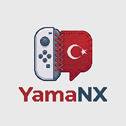
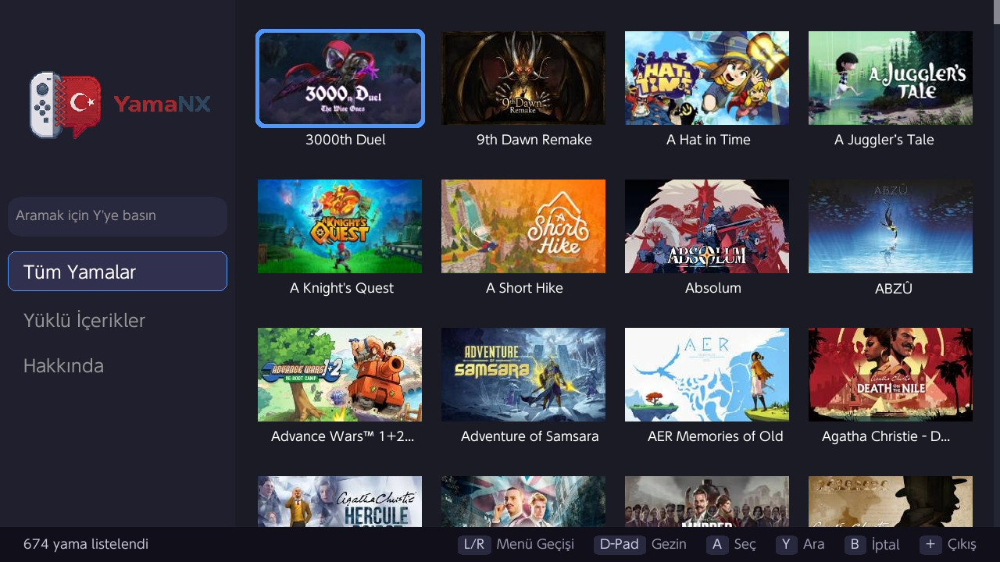
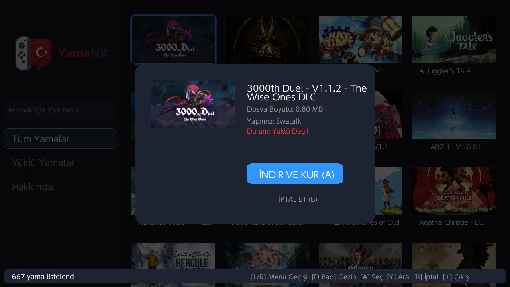
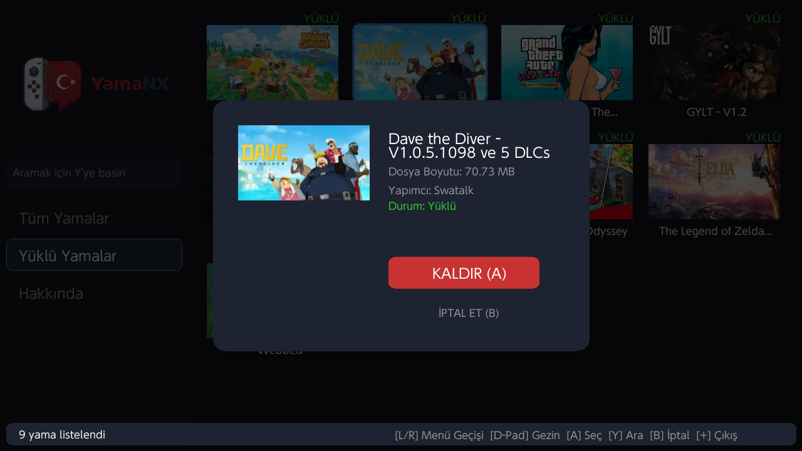
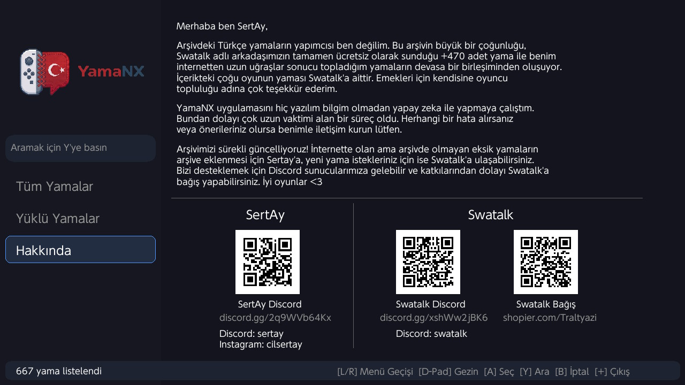
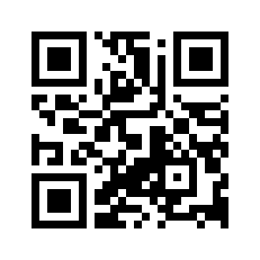
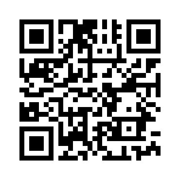

# YamaNX - Nintendo Switch Türkçe Yama Yükleyicisi

  
   
  <i>Nintendo Switch için oyunlarınızı Türkçeleştirmenin en kolay yolu.</i>

---

## 📸 Uygulama Ekran Görüntüleri

  
  
    
  
  

---

## 📖 Proje Hakkında ve Geliştirici Notu

Merhaba, ben SertAy. 

YamaNX uygulamasını, daha önce hiçbir yazılım tecrübem olmadan tamamen yapay zeka desteğiyle sıfırdan geliştirmeye çalıştım. Bu nedenle ortaya çıkması uzun vaktimi alan, bolca emek içeren bir süreç oldu. Uygulamayı kullanırken herhangi bir hatayla karşılaşırsanız veya geliştirilmesi yönünde önerileriniz olursa lütfen benimle iletişim kurmaktan çekinmeyin.

## ✨ Özellikler

- **Kullanıcı Dostu Arayüz**: Borealis UI kullanılarak tasarlanmış modern, şık ve akıcı Switch arayüzü.
- **Otomatik Kurulum**: Seçtiğiniz oyunun yamasını tek tıkla indirir ve SD kartınızdaki doğru klasöre (`atmosphere/contents` veya `titles`) otomatik olarak çıkartır.
- **Dinamik Veri Çekme**: Yamalar sürekli güncel kalacak şekilde çevrimiçi olarak listelenir.
- **Hızlı Erişim**: Hakkında menüsünde yer alan QR kodlar ile Discord sunucusuna veya geliştirici sayfalarına hızlıca ulaşın.

## 🚀 Kurulum ve Kullanım

1. [Releases](../../releases) sayfasından en güncel `YamaNX.nro` dosyasını indirin.
2. SD kartınızdaki `switch/` klasörünün içine bu dosyayı atın. *(Eğer klasör yoksa oluşturun: `SD:/switch/YamaNX.nro`)*
3. Switch üzerinden **Homebrew Menu**'ye (hbmenu) girip YamaNX uygulamasını çalıştırın.

💡 **Önemli Not (Büyük Boyutlu Yamalar İçin):**
Nintendo Switch üzerinden doğrudan büyük boyutlu yama dosyalarını indirmek, konsolun Wi-Fi hız limitleri nedeniyle bazen uzun sürebilir. Daha hızlı bir alternatif olarak; **Swatalk'ın Discord sunucusuna** katılıp yamaları bilgisayarınıza indirebilir ve bir Type-C kablo yardımıyla Switch'inize manuel olarak kurabilirsiniz.

---

## 🗄️ Yama Arşivi Hakkında

Arşivdeki Türkçe yamaların yapımcısı ben değilim. Bu devasa arşiv; **Swatalk** adlı arkadaşımızın tamamen ücretsiz olarak sunduğu +470 adet yama ile benim internetten uzun uğraşlar sonucu topladığım yamaların birleşiminden oluşmaktadır. 

İçerikteki çoğu oyunun yaması ve emeği **Swatalk**'a aittir. Muazzam emekleri için kendisine oyuncu topluluğu adına çok teşekkür ederim.

---

## 🔗 İletişim, Destek ve Bağış

### 🛡️ SertAy (YamaNX Geliştiricisi)
*Uygulama hataları ve arşivdeki eksik yamaların eklenmesi için:*

| Linkler | QR Kod |
| :--- | :--- |
| **Discord:** [Piksel Kardeşliği](https://discord.gg/2q9WVb64Kx)   **Instagram:** [@cilsertay](https://instagram.com/cilsertay) |  |

---

### 👑 Swatalk (Yama Çevirmeni)
*Yeni yama istekleri ve arşive destek olmak için:*

| Linkler | QR Kodlar |
| :--- | :--- |
| **Discord Sunucusu:** [Katılmak İçin Tıklayın](https://discord.com/invite/xshWw2jBK6) |  |
| **Bağış:** [Destek Olmak İçin Tıklayın](https://www.shopier.com/Traltyazi) |  |

 

İyi oyunlar! &lt;3

